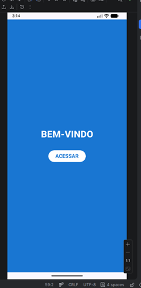
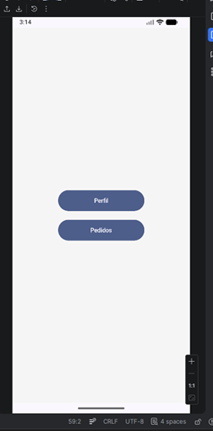
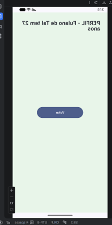
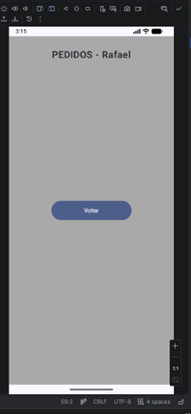

# Projeto de Navegação entre Telas - Kotlin

Este projeto demonstra a implementação de navegação entre telas em um aplicativo Android utilizando Jetpack Compose e a biblioteca Navigation Compose.

## 📱 Demonstração do Funcionamento

### Tela de Login

### Menu Principal

### Perfil do Usuário (Parâmetros Obrigatórios)

### Lista de Pedidos (Parâmetros Opcionais)

---
**Desenvolvido por:** Rafael Catapani Scharlack